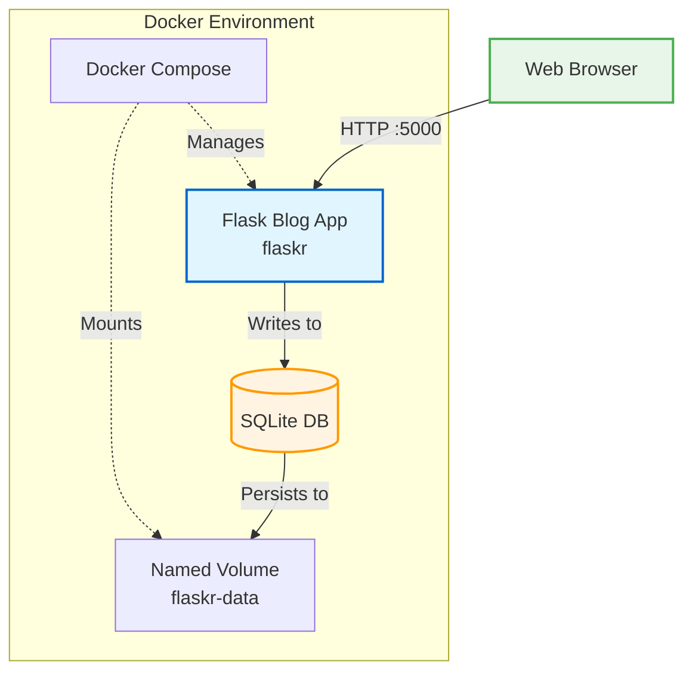

<div align="center">
<h3 align="center">Ops Blog</h3>
<p>DevOps-focused automation for a Flask blog application</p>

[](https://github.com/chamodidesilva/Ops-Blog/actions/workflows/ci.yml)


</div>

<details>
  <summary>Table of Contents</summary>
  <ol>
    <li>
      <a href="#project-overview">Project Overview</a>
      <ul>
        <li><a href="#tech-stack">Tech Stack</a></li>
        <li><a href="#current-features-v010">Current Features</a></li>
      </ul>
    </li>
    <li>
      <a href="#running-locally">Running Locally</a>
      <ul>
        <li><a href="#prerequisites">Prerequisites</a></li>
        <li><a href="#installation">Installation</a></li>
      </ul>
    </li>
    <li>
      <a href="#usage">Usage</a>
      <ul>
        <li><a href="#user-authentication">User Authentication</a></li>
        <li><a href="#blog-functionality">Blog Functionality</a></li>
        <li><a href="#data-persistence">Data Persistence</a></li>
      </ul>
    </li>
    <li><a href="#high-level-system-architecture">High Level System Architecture</a></li>
    <li><a href="#roadmap">Roadmap</a></li>
    <li><a href="#contributing">Contributing</a></li>
    <li><a href="#license">License</a></li>
    <li><a href="#contact">Contact</a></li>
    <li><a href="#acknowledgments">Acknowledgments</a></li>
  </ol>
</details>

## Project Overview

**Ops Blog** is a personal DevOps-focused learning project built around a blog application created with Flask.
The primary goal of this repository is not application complexity, but to **design, implement, and evolve real-world DevOps workflows**—including CI/CD, containerization, monitoring, and infrastructure orchestration. This project evolves through clearly versioned releases, each introducing a new operational capability.

The application workload is inspired by the [official Flask blog tutorial](https://flask.palletsprojects.com/en/stable/tutorial/).

### Tech Stack

[](https://www.python.org/)
[](https://flask.palletsprojects.com/)
[](https://www.docker.com/)
[](https://www.sqlite.org/)

### Current Features (v0.1.0)

#### Application

- User authentication with register, login and logout
- Blog posts: display, create, update and delete
- SQLite database with persistent storage

#### DevOps and Platform
- Flask application containerized with Docker
- Docker compose orchestration
- Persistent named volume for database
- CI pipeline with linting, functional tests and test coverage (see docs/ci-cd-pipeline.md)

#### Git Workflow
- Branching strategy: main/staging/feature* 
- Release strategy:
  - Development happens on `feature/*` branches
  - Features are merged into `staging` for integration and validation
  - Stable changes from `staging` are merged into `main`
  - Each merge to `main` is tagged using semantic versioning and published as a GitHub release
- Branch naming follows <a href="https://conventional-branch.github.io/">Conventional Branch</a>
- Commit naming follows <a href="https://www.conventionalcommits.org/en/v1.0.0/">Conventional Commits</a>

## Running Locally

### Prerequisites

- Have Docker, Docker compose installed

### Installation

1. Clone the repo
   ```sh
   git clone https://github.com/chamodidesilva/Ops-Blog.git
   ```
2. Run docker compose
   ```sh
   docker compose up -d
   ```

## Usage

After starting the application with Docker Compose, access the blog application in your browser: http://127.0.0.1:5000/hello

The home page displays published blog posts.

---

### User Authentication

The application supports basic user authentication:

- Register a new user account
- Log in and log out
- Authenticated users can create, edit, and delete their own blog posts

User sessions are handled by the Flask application.

---

### Blog Functionality

Once logged in, users can perform full CRUD operations on blog posts:

- **Create** new blog posts
- **View** existing blog posts on the home page
- **Update** previously created posts
- **Delete** posts they own

Changes are reflected immediately in the UI.

---

### Data Persistence

The application uses a SQLite database stored in a Docker named volume.

- Blog posts and user data persist across container restarts
- Stopping and starting the application does not reset application data

## High Level System Architecture


## Roadmap

- **v0.1.0 – Application & Container Foundation** *(Current)*
  - Stable Flask blog application with CRUD functionality
  - Containerized local setup using Docker Compose

- **v1.x – Orchestration & Observability**
  - Deploy the application to Kubernetes
  - Introduce Prometheus-based metrics and monitoring

- **v2.x – Cloud & GitOps**
  - Migrate the cluster to AWS (EKS)
  - Provision infrastructure using Infrastructure as Code
  - Introduce GitOps-style deployment workflows

## Contributing

If you have any suggestions to make this project better, please fork the repo and open a pull request. 

For major changes, please open an issue first
to discuss what you would like to change.

## License
This project uses the [MIT](https://github.com/chamodidesilva/Ops-Blog/blob/main/LICENSE) license.

## Contact
Email: chamodidesil@gmail.com

## Acknowledgments
Resources that helped me throughout this project and may support you on yours.
* [Flask tutorial](https://flask.palletsprojects.com/en/stable/tutorial/)
* [Local application monitoring testing with Docker Compose](https://dev.to/camptocamp-ops/testing-application-monitoring-locally-with-a-docker-composition-47hn)
* [The CI/CD handbook](https://www.freecodecamp.org/news/learn-continuous-integration-delivery-and-deployment/)
* [Choose an Open Source License](https://choosealicense.com)
