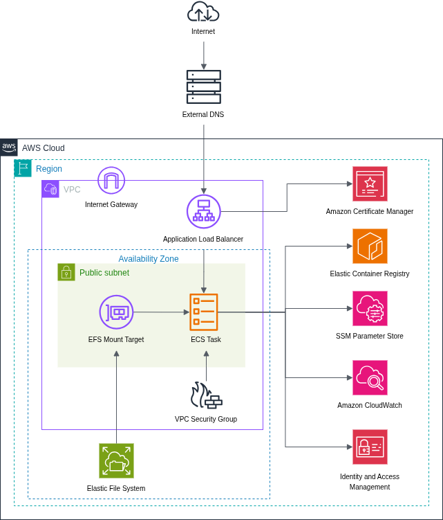

    <picture>
        
    </picture>
    

  
Table of Contents

  <ol>
    <li>
      <a href="#project-overview">Project Overview</a>
      <ul>
        <li><a href="#tech-stack">Tech Stack</a></li>
        <li><a href="#application-capabilities">Application Capabilities</a></li>
      </ul>
    </li>
    <li>
      <a href="#the-devops-and-cloud-evolution">The DevOps and Cloud Evolution</a>
    </li>
    <li>
      <a href="#cloud-infrastructure-architecture">Cloud Infrastructure Architecture</a>
      <ul>
        <li><a href="#high-level-components">High Level Components</a></li>
      </ul>
    </li>
    <li><a href="#iac-deployment">IaC Deployment</a></li>
    <li><a href="#devops-automation-and-git-workflow">DevOps Automation and Git Workflow</a>
      <ul>
        <li><a href="#automated-pipelines">Automated Pipelines</a></li>
        <li><a href="#git-strategy">Git Strategy</a></li>
      </ul>
    </li>
    <li><a href="#live-demo-on-demand-provisioning">Live Demo: On-Demand Provisioning</a></li>
    <li><a href="#contributing">Contributing</a></li>
    <li><a href="#license">License</a></li>
    <li><a href="#contact">Contact</a></li>
  </ol>

## Project Overview

**Ops Blog** is a DevOps-focused learning and showcase project designed to implement, test, and evolve real-world DevOps, Infrastructure as Code (IaC), and Cloud Native workflows. 
To keep the project focused on DevOps practices and operational aspects of software delivery rather than application development, the application tier uses a customized version of the [official Flask blog tutorial](https://flask.palletsprojects.com/en/stable/tutorial/). 
The core value of this repository lies entirely in how this standard workload is containerized, secured, automated, and orchestrated across cloud environments.

### Tech Stack
* **App Tier:** Python, Flask, SQLite
* **Infrastructure & Orchestration:** AWS (ECS Fargate, ALB, EFS), Terraform
* **CI/CD & Security:** GitHub Actions, Trivy, Docker, AWS OIDC

---

### Application Capabilities

- User authentication with register, login and logout
- Blog posts: display, create, update and delete
- SQLite database with persistent storage

## The DevOps and Cloud Evolution

This project is structured chronologically through major releases to demonstrate a practical journey from local development to cloud-native scalability:

* **v0.1.0 (Local Containerization - Test):** Dockerizing the application, managing multi-container states with Docker Compose, and securing persistent local volumes.
* **v1.0.0 (Cloud Native Infrastructure - Current/Stable):** Transitioning the architecture completely to AWS using Terraform, abstracting networks, automating GitOps provisioning pipelines, and isolating computing layers using serverless containers.

---

## Cloud Infrastructure Architecture

The application is deployed on AWS using an immutable, highly secured Infrastructure-as-Code footprint managed via Terraform.

    <picture>
        
    </picture>

### High Level Components:
* **DNS Routing & Network Security:** A domain name (**opsblog.site**) for this app is registered in an external domain registrar and DNS service provider and connects to an **Application Load Balancer (ALB)** in AWS that manages external HTTP/HTTPS traffic and has a public SSL certificate attached via Amazon Certificate Manager. While the workload lives in a public subents intentioanlly for enabling outbound traffic bypassin the need for a NAT gateway, the network paths are strictly isolated using linked, stateful Security Groups.
* **Identity Management:** AWS IAM manages cross-service access through IAM roles. ECS utilizes task execution and task roles to pull ECR images, SSM Parameter Store secrets, EFS read/writes and CloudWatch log injections. 
* **Compute:** **AWS ECS Fargate** processes application workloads in serverless containers, completely eliminating host EC2 management overhead and **Fargate Spot** capacity provider strategy ensures further cost savings. 
* **State & Persistence:** SQLite databases are attached securely to an **Amazon EFS (Elastic File System)** volume, guaranteeing container data survival across rapid tasks updates and secure connections to the file system is achieved through an Access Point. 
* **Monitoring:** an **Amazon CloudWatch** log group with a retention rule collects logs sent from ECS tasks for quick task failure troubleshooting visibility
* **Secret Management:** AWS Systems Manager's Parameter Store securely and cost effectively stores the application's session keys

**Note:** Currently, all resources except ALB and ECS service are deployed in AWS and the setup to miss out on ALB and ECS is intentional to keep costs under control. Terraform code is setup to spin up the entire infrastructure in a single command in under 5 minutes. 

---

## IaC Deployment

Terraform code is distributed as per the category of AWS infrastructure like Networking, Config, Filesystem, ALB, Containers and etc, for convenience and Terraform state is managed remotely in AWS S3.

The partial deployment of infrastructure is implemented using the count meta argument by providing a variable to destroy only the ALB and ECS service resources while keeping the other resources intact. 

## DevOps Automation and Git Workflow  

### Automated Pipelines

Pipelines are setup to trigger only on pull request creation and synchronization and **dorny/paths-filter** action is utilized to detect changes in file paths and trigger the specific pipeline/jobs. 

* **`app-ci.yaml`:** Triggered on pull requests created for application code/Dockerfile related changes. Automatically executes code linting, code validation, vulnerability scanning via **Trivy**, logs securely into AWS using secure **OIDC**, builds the optimized Docker images, and tags/pushes them cleanly to Amazon ECR.
* **`infra-pipeline.yaml`:** Automates the Terraform execution loop and triggers for changes to the **terraform/** directory. Validates configurations, triggers configuration misconfiguration scans, generates execution plan files, and applies changes seamlessly inside AWS environment. 

### Git Strategy
* **Branching Strategy:** Maintained via a clean `main` / `develop` / `feature/*` pipeline topology. 
* **Standards:** Adheres strictly to [Conventional Commit](https://www.conventionalcommits.org/) formatting rules and [Conventional Branching](https://conventional-branch.github.io/) structures to maintain auto-parsable semantic release records.

---

## Live Demo: On-Demand Provisioning

In alignment with real-world **FinOps best practices**, this infrastructure is kept in a hybrid state of readiness to minimize unnecessary active cloud run-costs. The global DNS assets, base security perimeters, task definitions, and registries remain active, while computing and routing structures are destroyed when idling. 

* **Reach Out:** A live demo could be provided to anyone interested if reuqested through **chamodidesil@gmail.com**.
* **On-Demand Provisioning:** I will trigger the automated GitHub Actions pipeline and within **under 5 minutes**, Terraform will dynamically provision the full AWS ECS stack, pass architectural security scans, and the application will be available through `https://opsblog.site`.

## Contributing

If you have any suggestions to make this project better, please fork the repo and open a pull request. 

For major changes, please open an issue first
to discuss what you would like to change.

## License
This project uses the [MIT](https://github.com/chamodidesilva/Ops-Blog/blob/main/LICENSE) license.

## Contact
* **Email:** chamodidesil@gmail.com
* **LinkedIn:** [[My Profile](https://www.linkedin.com/in/chamodi-de-silva/)]
