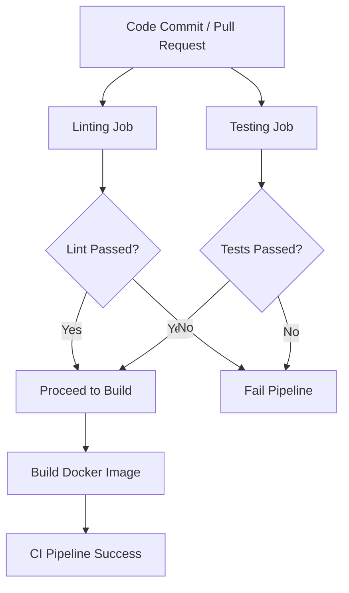

# CI/CD Pipeline Documentation

## Overview

This project uses GitHub Actions to implement a Continuous Integration (CI), Continous Delivery (CD) pipeline.  
The goal of the CI pipeline is to automatically validate code changes through linting, unit testing, and Docker image builds before changes are merged into protected branches.

Continuous Deployment (CD) will be added in a later phase to deploy the application to staging and production environments.

---

## Objectives of the CI Pipeline

The CI pipeline is designed to:

- Automatically validate every code commit
- Enforce coding standards using linting
- Detect bugs early using automated unit tests
- Ensure the application can be successfully containerized
- Act as a quality gate before merging into `staging` or `main`

---

## When the CI Pipeline Runs (Triggers)

The CI workflow is triggered on the following events:

| Event Type        | Branches              | Purpose |
|------------------|------------------------|--------|
| Pull Request     | `staging`, `main`      | Validate changes before merge |
| Push             | `staging`, `main`, `feat/*` | Validate direct pushes and feature development |
| Manual Trigger   | Any branch             | Manual testing and debugging |

This ensures that both feature development and integration branches are continuously validated.

---

## CI Pipeline Architecture

The CI pipeline consists of three independent jobs executed on separate runners:

1. Linting Job
2. Unit Testing Job
3. Docker Build Job

---

## Job Details

### 1. Linting Job

**Purpose:**  
Ensures that the code follows Python style and quality standards.

**Steps:**
- Checkout source code
- Set up Python environment
- Install application and development dependencies
- Run Flake8 on the application source directory

**Linting Rules Configuration:**

The following selected error and warning codes are excluded to reduce noise from non-critical style issues during early development.

Ignored Flake8 checks:
- `E501` — line length exceeds limit
- `E302` — expected 2 blank lines
- `W293` — blank line contains whitespace
- `W391` — blank line at end of file

These rules can be tightened as the project matures.

**Tools Used:**
- Python 3.12
- Flake8

---

### 2. Unit Testing Job

**Purpose:**  
Validates application logic using automated unit tests included in the tests/ directory

**Steps:**
- Checkout source code
- Set up Python environment
- Install dependencies
- Run Pytest test suite

**Tools Used:**
- Pytest

---

### 3. Docker Build Job

**Purpose:**  
Verifies that the application can be successfully containerized.

**Execution Condition:**
- Runs only if linting and unit tests pass

**Steps:**
- Checkout source code
- Build Docker image using repository Dockerfile
- Tag image using commit SHA

**Note:**  
At this stage, the image is built only for validation and is not pushed to a registry.  
Image publishing will be added as part of the CD pipeline.

---

## Branch Protection and Quality Gates

The `main` and `staging` branches are protected with the following rules:

- Pull requests are required before merging
- CI status checks must pass before merge is allowed

This ensures that only validated code is integrated into stable branches.

---

## Future CD Implementation (Planned)

The following enhancements are planned for the Continuous Deployment phase:

- Push Docker images to container registry
- Deploy to production on `main` branch merge

---

## Related Files

- `.github/workflows/ci.yml` — CI workflow definition
- `.flake8` - Flake8 linting configuration file
- `tests/*` - Unit tests
- `Dockerfile` — Application container configuration
- `requirements.txt` — Runtime dependencies
- `requirements-dev.txt` — Development and testing dependencies
