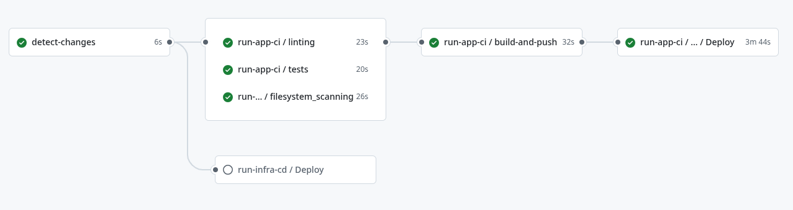
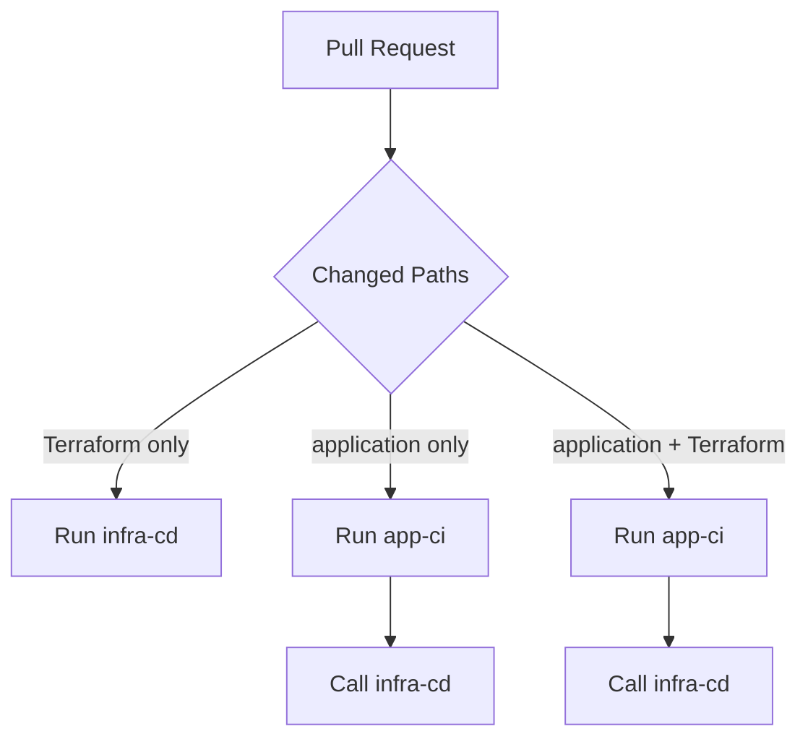

# CI/CD Pipeline Documentation

## Overview

### Project Context
Ops-Blog is a solo engineering project that does not serve any users in the standard application delivery context. Because of that, some features in standard CI/CD pipelines do not serve a real purpose for this project. To optimize automation and remove unnecessary features, the CI/CD pipeline for Ops-Blog is customzied to serve automation purposes specific to Ops-Blog.

The project utilizes a single-account AWS environment as opposed to multi environments (eg: staging/production) in standard deployment practices. This environment is kept ephemeral to align with the main AWS architectural concern in this project: cost optimization.

### Branching Strategy
* `main` - source of truth which carries the ultimate stable code
* `develop` - integration branch which serves as the starting point of workflow automation
* `feat/*` - short lived branches that isolates specific feature implementations

New features are mainly tested in the local development environment in **feature** branches before being integrated to the **develop** branch. 

**Pull Requests** for develop/main branches are treated as a testing ground where ephemeral infrastructure is provisioned, tested upon with changes introduced in PRs and destroyed. 

### Pipeline Goals
* Ensure that application and infrastructure changes are automatically integrated and tested within a temporary AWS deployment before being merged into log-lived branches (develop, main).
* Execute only the workflows required for the type of change introduced, reducing execution time, AWS usage and cost, and redundant deployments.
* Adopt a shift-left approach by performing code quality checks, automated testing, vulnerability scanning, and Terraform validation before infrastructure changes are applied.

---

## Pipeline Design

### Overview
The pipeline is separated into 3 GitHub Actions Workflows: **`orchestrator.yaml`**, **`app-ci.yaml`**, **`infra-cd.yaml`**

* **orchestrator.yaml** - orchestrates the runs of app-ci and infra-cd worklfows by executing the `dorny/paths-filter` change detection logic
* **app-ci.yaml** - automates the app code change integration by executing the jobs across linting, testing, security scanning, authenticating with AWS, image  artifact building and pushing to remote image repository and calling the infra-cd workflow to deploy app changes across infrastructure. 
* **infra-cd.yaml** - automates IaC code change integration by executing Terraform validation, authenticating with AWS, Terraform planning, misconfiguration scanning and applying planned changes to AWS. 

### Workflow Responsibilities

#### App-CI

| Job                 | Purpose                                                                             |
| ------------------- | ----------------------------------------------------------------------------------- |
| linting             | Runs flake8 against application code                                                |
| tests               | Executes functional tests with coverage enforcement                                 |
| filesystem_scanning | Performs dependency, secret and misconfiguration scanning using Trivy               |
| build-and-push      | Builds the Docker image, scans it, authenticates to AWS and pushes it to Amazon ECR |
| deploy              | Calls infra-cd.yaml and passes the image tag                                        |

#### Infra-CD

| Job    | Purpose                                                                                                                             |
| ------ | ----------------------------------------------------------------------------------------------------------------------------------- |
| Deploy | Initializes Terraform, validates configuration, creates a plan, performs configuration scanning, and applies infrastructure changes |

#### Orchestrator

| Job                 | Purpose                                                              |
| ------------------- | ---------------------------------------------------------------------|
| detect changes      | Identify the changed file paths in PR and populate boolean variables |
| run-app-ci          | Call app-ci.yaml based on change detection condition                 |
| run-infra-cd        | Call infra-cd.yaml based on change detection condition               |

### Workflow Graph

    <picture>
        
    </picture>

The 2 workflows: **app-ci** and **infra-cd** are called as extensions of the **orchestrator** workflow, so at all times, the workflow run starts with **orchestrator** and goes onto execute either **app-ci** or **infra-cd***. 

Jobs in GitHub Actions workflows run parallely by default. But this default behaviour could pose issues like some jobs still executing despite earlier jobs being failed. This leads to wasted time and resources. So, to make a dependency between selected jobs and run them sequentially instead of parallely, the `needs` keyword is used to create **dependencies** for jobs like image creation to only run if other previous jobs like lintng, testing and security scanning have run successfully. 

### Workflow Execution Paths
As both application and infrastructure code lives in the same repository, scenarios specific to each type of files require specific workflow pathways. The following flow chart describes the execution paths the current pipeline design considers.

```mermaid
flowchart TD

Start[Pull Request]

Start --> Detect{Changed Paths}

Detect -->|Terraform only| Infra[Run infra-cd]

Detect -->|application only| App[Run app-ci]

Detect -->|application + Terraform| App2[Run app-ci]

App --> Deploy[Call infra-cd]

App2 --> Deploy2[Call infra-cd]
```

Several pathways/scenarios the workflow could take were considered when designing based on the type of change being introduced in the PR,
* For **Terraform only** changes - runs infra-cd.yaml independently (after being called from orchestrator.yaml) without being called from the app-ci.yaml. Utlizes an existing image tag for testing as new image builds are not carried out. Hence the `workflow_call` input is set to be optional. 
* For **app code only** changes - executes app-ci.yaml and calls infra-cd.yaml using `workflow_call` trigger. This executes the app code related jobs as well as the infra-cd jobs to test the newly introduced app code bundled image in the infrastructure. 
* For changes involving **both app code and Terraform** - since infra-cd.yaml already runs when app-ci.yaml is called, and to stop the redundant runs of infra-cd due to Terraform related changes, infra-cd independent run is only set to be executed if no app-code changes are detected.

### Workflow Orchestrator Purpose

### Why an Orchestrator?

The pipeline was initially implemented using two independent GitHub Actions workflows: one responsible for application CI and another for infrastructure deployment. While this approach worked for isolated application or infrastructure changes, it introduced an issue when a pull request contained changes to both application and Terraform code. Since both workflows were triggered independently, the infrastructure deployment workflow executed twice: once directly for the Terraform changes and once indirectly after the application workflow completed.

To eliminate this duplication, an orchestration workflow was introduced as the single entry point for the CI/CD pipeline. The orchestrator performs path-based change detection using `dorny/paths-filter` and determines which reusable workflows should be executed based on the type of changes contained in the pull request.

This centralized orchestration provides several benefits:

* Prevents duplicate infrastructure deployments when pull requests contain both application and infrastructure changes.
* Executes only the workflows required for the specific change set, reducing unnecessary workflow runs and AWS resource usage.
* Separates change detection and workflow routing from the implementation of application and infrastructure pipelines, resulting in simpler and more maintainable reusable workflows.
* Establishes a single, predictable execution path for every pull request, making the pipeline easier to understand and extend.

### Workflow Triggers

2 main workflow trigger types are used across the workflows: **`pull_request`** and **`workflow_call`**. 

#### Pull Request

Pull requests are treated as the testing ground in this project where new changes are integrated, tested upon and fixed if encountered errors. Also, **Push** triggers are **not** used in the pipeline bcause pushes triggers the workflow while the changes are being merged to the target branch meaning the workflow hasn't validated the changes yet. Since the workflow target braches especially main, are treated as the branches for keeping the tested out and stable code instead of branches for triggering deployments, adding a push trigger only makes the workflows runs unnecessarily redundant. So, only the `pull_request` event trigger is used along with `workflow_call`.

The `pull_request` trigger is only used by `orchestrator.yaml` as downstream workflows that orchestrator calls (app-ci and infra-cd) only need the `workflow_call` trigger. 

Orchestrator workflow get triggered by pull request creation or synchronization and app-ci and infra-cd only had the workflow_call trigger meaning they can only be called from the orchestrator workflow as reusable workflows. 

#### Workflow Call

**`workflow_run`** was the event trigger initially used to chain workflows together but an issue was identified with workflow_run which is that workflow_run trigger specifically require the workflow that uses it to be available in the main branch, and always reads the workflows from the main branch, which forces iterative workflow development changes to be frequently pushed to main branch making it a testing branch rather than a branch with stable code which goes against the branching strategy Ops-Blog uses. 

Due to that issue, an alternative trigger: **`workflow_call`** is used to make workflows reusable and dependent. 

With workflow_call, the workflows involved can be kept seperated and also connected. The outputs from the calling workflow can be passed down to the workflow being called as inputs (using **`secret`** field's **`inherit`** feature), which is used to pass the image tags generated from the image build step to the infra-cd workflow to later pull the exact image pushed initially. 

For independent infra-cd workflow runs, where only Terraform code changes are detected, an image tag is not being passed as it's not called from app-ci. So the image tag is set to be **optional** and if no image tag is passed, a default tag of an already existing image is used for testing.

---

## Pipeline Security

This pipeline implements **DevSecOps** practices to a certain degree to achieve a **shift-left** security approach to identify and mitigate security issues early on in the pipeline. 

### OIDC 

Rather than storing long-lived AWS access keys as GitHub Secrets, this project uses OpenID Connect (OIDC) federation between GitHub Actions and AWS. During workflow execution, GitHub requests a signed OIDC identity token which AWS Security Token Service (STS) validates. If the repository and workflow satisfy the IAM role trust policy, AWS issues temporary credentials for that workflow run. These credentials automatically expire after the workflow completes, eliminating the need to manage permanent AWS credentials.

App-ci and infra-cd workflows assume 2 different IAM roles based on their function,

| Role          | Purpose                                                                                             | Workflow |
| --------------| ----------------------------------------------------------------------------------------------------|----------|
| ECR role      | Provide access required for image uploads/downloads for private ECR repos                           | App-CI   |
| Infra role    | Provide administrator access required for Terraform to provision resources across multiple services | Infra-CD |

The roles' trust policies restrict access based on conditions: token audience and subject requesting the token.

OIDC token persmissions are also provided in the workflows which is required for the token to be created and presented. 

### Vulnerability Scanning

**Trivy** is the open source vulnerability scanning tool used for automated security scanning across worklfows and multiple Trivy scan types are used,
* filesystem scan - scan application dependencies like packages and modules 
* image scan - scan the image artifact including the base layers
* config scan - scan Terraform configuration to identify misconfigurations exposing security issues in resources

These scans are configured to ignore the vulnerabilities what has no known fixed released yet and filters out only the most severe forms of vulnerabilites: critical, high. 

Since the standard security scanning tool for Terraform **tfsec** is now a part of Trivy, same tool is used for Terraform scans as well. 
