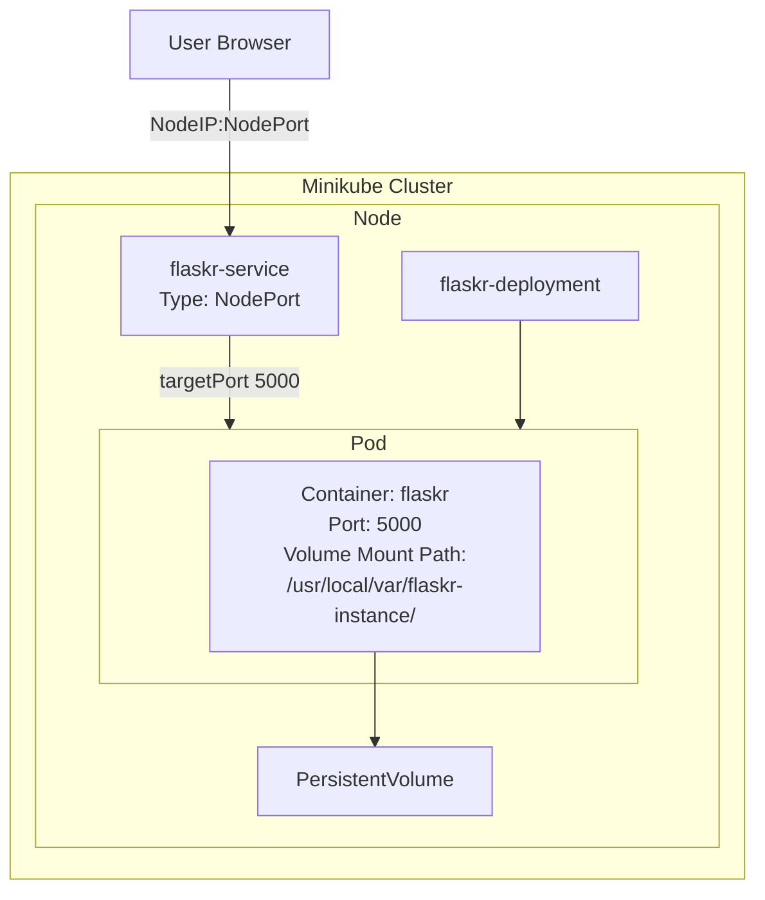

# Deployment Documentation

## Overview

This document describes the current deployment architecture of the application running on a local Kubernetes cluster.

The deployment is currently manual (kubectl-based). Automated CD will be introduced
after migration to a cloud environment.

---

## Environment

Cluster type: Local </br>
Tool used: Minikube </br>
Container Runtime: Docker

---

## Architecture

The cluster workload consists of:

- 1 Deployment
- 1 Service
- 1 PersistentVolumeClaim



### Deployment

Kubernetes workload object resource used to provision the pods. Deployment manages the pod creation, rolling updates, rollbacks and pod replacement.

#### Container Configuration

The pod runs a single container:

- Name: flaskr
- Image: deploy-ops-blog:latest (name as in the context of local development)
- Image Pull Policy: IfNotPresent (Prioritizes local image repository over pulling from a remote)
- Volumes: 
    automatically created from the persistent volume claim by Minikube and mounted to the path used   by the SQLite to store the database schema in the container. 

### Service

Service resource object is used to expose the pod over a network to enable inbound traffic to the application. 
 
- Selector: select the pod labeled with 'web' to expose
- Service type: NodePort
- NodePort: Uses the IP of the node which in the case with Minikube is the default single node (container) acting as both the control plane and the worker node. 
- port: defines the port used by the service to direct inbound traffic to the relevant pod
- targetPort: defines the port inside the pod which recieves the traffic

### Persistent Volume Claim

Volume claim creates a reservation for storage resources in the cluster which if not present, will be created based on the default storage class (which is automatically set by Minikube). In local development cluster, the storage is obtained from the host's filesystem. 

- Access mode: ReadWriteOnce (mounted by a single node at a time and written by a single pod)
- Storage size: 1Gi 

---

## Manual Deployment Steps

Load the Docker image from host's Docker to Minikube's Docker environment
```sh
minikube image load deploy-ops-blog:latest
```

Apply manifest files
```sh
kubectl apply -f K8s/
```

Verify Deployment
```sh
kubectl get pods
kubectl get svc
```
---

## Access the Application

Obtain the Minikube IP
```sh
minikube ip
```

To obtain service port (NodePort), check the 'PORT(S)' column of the output from,
```sh
kubectl get svc
```

Construct the URL from the format - **http://minikube_ip:nodeport** 

